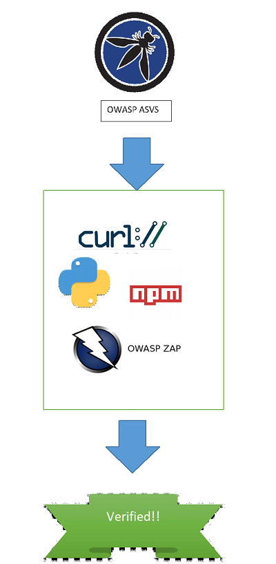

# Title of Project
Automation of OWASP ASVS Level 1 Verifications with Open Source 
Toolchains

# Problem Statement
The Open Web Application Security Project (OWASP) is known 
as one of the leading sources for web application security 
standards, knowledge, and tools. Its goal is to help make web
 applications more secure by empowering software teams with 
resources that are freely (libre and gratis) available and vendor agnostic.

One of the OWASP flagship projects is the
Application Security Verification Standard (ASVS), currently on version 4.

The ASVS contains a list of 14 categories of requirements around
verifying the security posture of an application. Each
requirement is coded to level 1, 2, or 3 to represent an
increasing level of depth to the verification.

Of interest for this project is the statement that all
level 1 verifications can be validated via (black box) penetration
testing.

# Opportunity
While the ASVS is a detailed list of requirements to achieve a
certain quanlity around an application's security maturity,
the ability to verify level 1 requirements is usually
dependent on the knowledge and skills of a penetration tester.

Simultaneously, OWASP produces guidance around tactical security
testing in various forms: cheat sheets, software testing guides,
and various lists such as the top ten controls and top ten risks.

The challenge for this project comes in answering the question, can 
the penetration test activities purported to be achievable for a level 1 (baseline) 
verification also be completed using open source tooling?  If so
what does that look like? Can those same activities become automated
using modern tooling? If not, where are the gaps for further research,
 and are there options to use freely available (but not open source) software?

# Value Proposition
Combining the ASVS level 1 requirement verification tasks with open source
tooling will undoubtedly provide a path for testers, CI/CD pipelines,
and security programs to literally level up their state of
software security testing and verification.

Artifacts of this project may include test scripts, configuration files, 
specific tool recommendations, and integration steps for CI/CD pipelines.

# Diagram

Conceptually...

